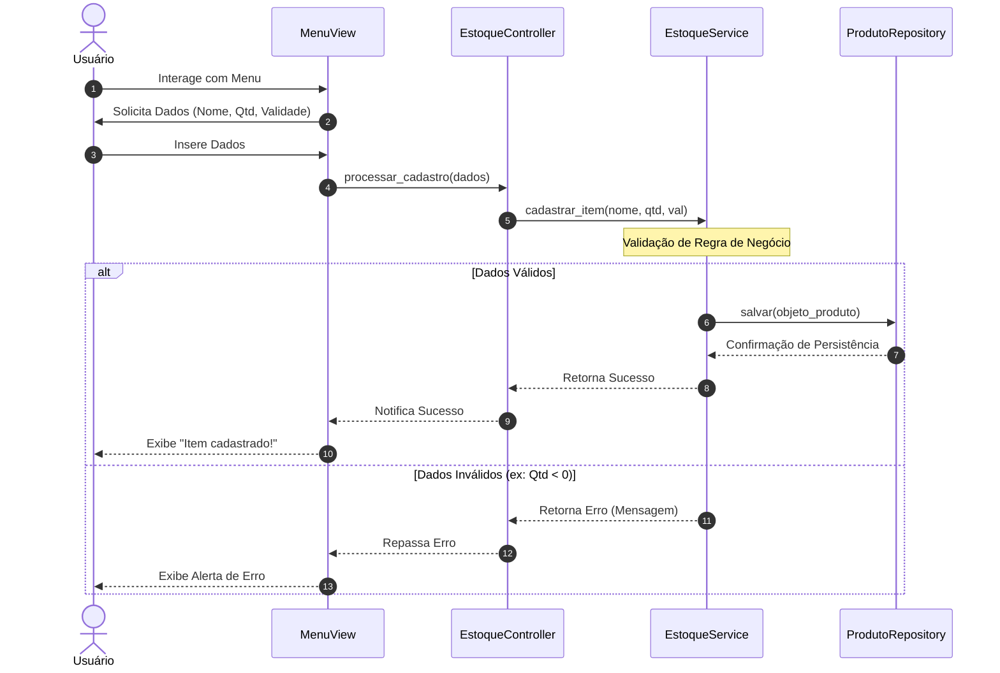
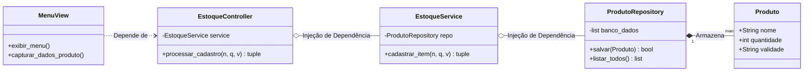

# Padrões de Arquitetura

Projeto desenvolvido como parte da atividade **[ATV 6] - Padrões de Projeto** da cadeira de Engenharia de Software. O objetivo é demonstrar a aplicação prática de padrões de arquitetura (ex.: em um sistema de controle de insumos e medicamentos veterinários.)

## Arquitetura e Padrões Utilizados

Foram aplicados três padrões principais:

### 1. MVC (Model-View-Controller)

O sistema separa a interface do usuário da lógica de processamento:

- **Model (`src/models`)**: Define a estrutura dos dados (Produto).
- **View (`src/views`)**: Gerencia a interação com o usuário no terminal.
- **Controller (`src/controllers`)**: Atua como o "maestro", recebendo comandos da View e coordenando as ações entre o Service e o Model.



---

### 2. Arquitetura em Camadas (Layered Architecture)

A organização segue níveis horizontais de responsabilidade, garantindo o isolamento das regras de negócio:

- **Camada de Apresentação**: Composta por Views e Controllers.
- **Camada de Negócio (`src/services`)**: Onde residem as validações e regras (ex: impedir nomes vazios ou quantidades inválidas).
- **Camada de Dados (`src/repositories`)**: Responsável pela persistência.

---

### 3. Repository Pattern

Utilizado para abstrair o acesso aos dados. O `EstoqueService` não sabe como os dados são salvos; ele interage apenas com o `ProdutoRepository`. Isso permite que, no futuro, a lista em memória seja substituída por um banco de dados real (SQL/NoSQL) sem alterar a lógica de negócio.



---

## 📂 Estrutura de Pastas

```text
estoque-clinica-vet/
├── main.py                 # Ponto de entrada da aplicação
├── README.md               # Documentação do projeto
└── src/
    ├── controllers/        # Intermediários de fluxo
    ├── models/             # Classes de domínio (dados)
    ├── repositories/       # Abstração de armazenamento
    ├── services/           # Regras de negócio e validações
    └── views/              # Interface com o usuário
```
